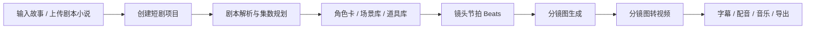

# 短剧工作室底层拆解与国内化方案

## 公开页面观察

- 形态：登录态工作台，不是普通营销官网。
- 前端：Next.js / React / Tailwind 风格组件，tRPC 调后端。
- 入口：剧本/小说上传或输入故事想法，支持单集/连续剧。
- 写作模型：助理编剧 0.5x、专业编剧 3x、顶级编剧 5x。
- 项目：项目列表、官方示例、最近修改、项目复制/删除/重命名。
- 制作区：Storyline、Board、Storyboard to Video、多场景、导出、视频修复。
- 计费：积分余额、积分模式、无限模式、并发限制、超时退款。
- 外部服务：独立后端、素材 CDN、NextAuth、Intercom、Bing/Facebook/TikTok 统计。

## 核心业务链路

## 国内版模块

- 前端工作台：短剧入口、项目中心、角色/场景/分镜/视频制作台。
- 项目服务：Project、Episode、Character、Location、Prop、Beat、Shot。
- 文件服务：TXT、MD、DOCX、PDF 解析，OSS/COS/MinIO 存储。
- 模型网关：编剧 LLM、GPT Image 2、Seedance 2.0，可替换即梦/可灵/通义万相。
- 任务队列：Redis + BullMQ / Celery，支持状态轮询、失败重试、积分冻结和退款。
- 积分账本：生成预估、消耗记录、退款记录、微信/支付宝充值。
- 合规层：内容安全、版权角色拦截、敏感词、国内备案与日志留存。

## 建议接口

- `POST /api/drama/projects` 创建项目。
- `POST /api/drama/projects/:id/source` 上传或登记剧本。
- `POST /api/drama/projects/:id/plan` 生成剧集规划。
- `PUT /api/drama/projects/:id/entities` 批量保存角色、场景、道具。
- `POST /api/drama/projects/:id/storyboards` 提交分镜图任务。
- `POST /api/drama/projects/:id/videos` 提交视频生成任务。
- `GET /api/drama/projects/:id/tasks` 查询任务进度。
- `POST /api/billing/credits/hold` 冻结积分。
- `POST /api/billing/credits/refund` 失败退款。

## 不建议照搬的部分

- 不复制 Topview 的代码、Logo、素材、示例项目、界面文案和品牌视觉。
- 不复用其后端接口或抓取用户数据。
- 国内版应保持同类工作流，但用原创命名、原创设计和自有模型/存储/支付链路。
